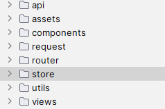
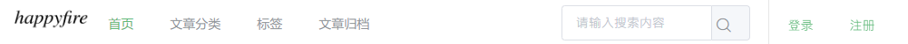
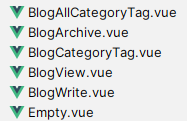

# blog-app-new
## 个人博客前端

采用技术：vue + Element

主要分为四个部分：首页、文章分类、标签、文章归档


首页按时间顺序显示最新发布的文章，首页的文章排序规则可以更改，如阅读量、评论量、自设权重值等，这里默认为按时间排序；文章归档根据时间线对文章进行管理，可以查看每年每月发布的文章。


文章分类根据前端、后端、数据库、编程语言等类别对文章进行管理；标签则支持根据springboot、springmvc等类别对文章进行分类；

其中、标签和分类都可以在后台管理系统中进行添加（后端：https://github.com/happyfir/blog-parent）

还可以查看最热标签、最热文章查看目前最热门的文章和讨论趋势


## 项目结构



api:包括前端向后端发送请求时用到的各种请求

assets: 一些前端用到的图标、图片

componements:各种小组件、如标签信息组件、分类信息组件、用户信息组件

request:request拦截器和token管理相关函数

router: 路由

store:用户登录、注册、登出等操作的处理、用户token的处理

utils:工具类

views:页面组件、包括登录、注册、文章标签、文章编辑、分类、标签等


页面包括三个部分：首部（header）、内容（container）、底部（footer）

首部和底部是固定的：




而中间内容部分则可以根据需要路由到不同的组件，展示不同的内容：如首页、文章分类、文章标签、文章归档

示例：



路由：

```js
const router = new VueRouter({
  routes: [
    {
      path: '/write/:id?',
    },
    {
      path: '',
      name: 'Home',
      component: Home,
      children: [
        {
          path: '/',
          component: r => require.ensure([], () => r(require('@/views/Index')), 'index')
        },
        {
          path: '/archives/:year?/:month?',
          component: r => require.ensure([], () => r(require('@/views/blog/BlogArchive')), 'archives')
        },
        {
          path: '/messageBoard',
          component: r => require.ensure([], () => r(require('@/views/MessageBoard')), 'messageboard')
        },
        {
          path: '/view/:id',
          component: r => require.ensure([], () => r(require('@/views/blog/BlogView')), 'blogview')
        },
        {
          path: '/:type/all',
          component: r => require.ensure([], () => r(require('@/views/blog/BlogAllCategoryTag')), 'blogallcategorytag')
        },
        {
          path: '/:type/:id',
          component: r => require.ensure([], () => r(require('@/views/blog/BlogCategoryTag')), 'blogcategorytag')
        }
        ...
      ]
    }
})
```

