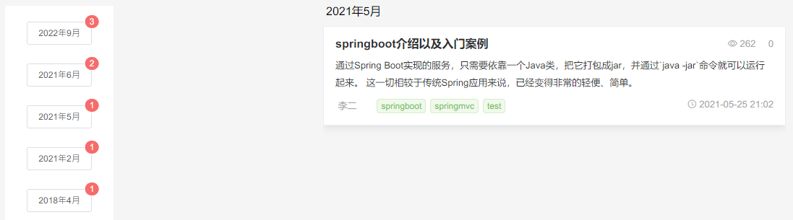
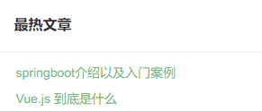
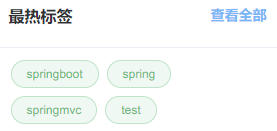

# blog-app-new
个人博客前端

主要分为四个部分：首页、文章分类、标签、文章归档

首页按时间顺序显示最新发布的文章，首页的文章排序规则可以更改，如阅读量、评论量、自设权重值等，这里默认为按时间排序；文章归档根据时间线对文章进行管理，可以查看每年每月发布的文章。

文章分类根据前端、后端、数据库、编程语言等类别对文章进行管理；标签则支持根据springboot、springmvc等类别对文章进行分类；

其中、标签和分类都可以在后台管理系统中进行添加（后端：https://github.com/happyfir/blog-parent）

还可以查看最热标签、最热文章查看目前最热门的文章和讨论趋势

